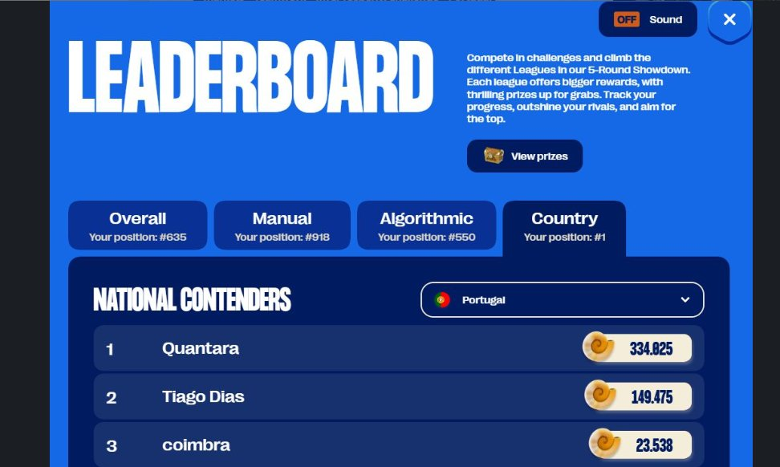
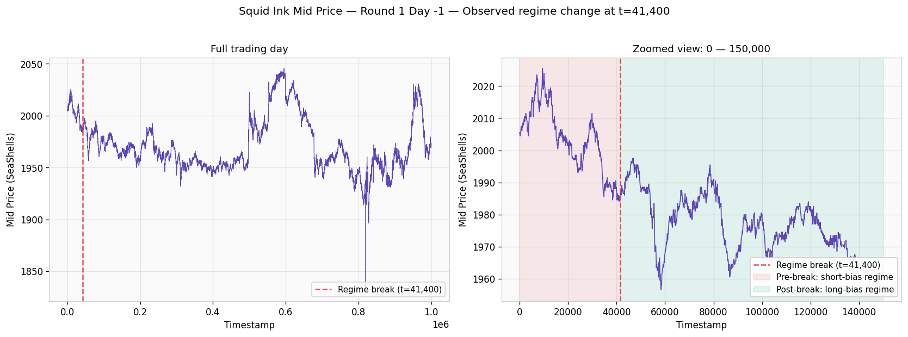
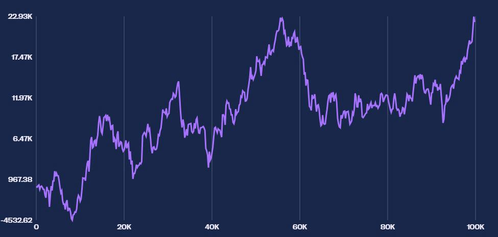
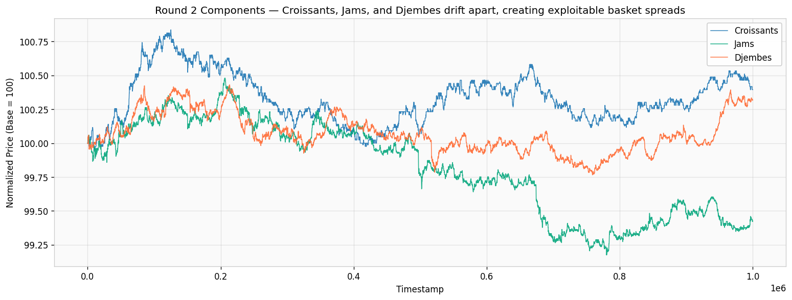
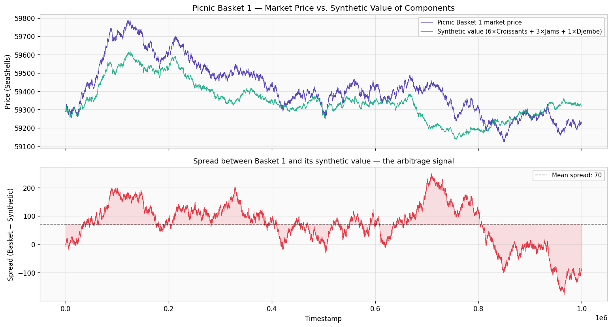

# IMC Prosperity 3 — Team Quantara

Algorithmic trading strategies and research notes from team Quantara's run at 
IMC Prosperity 3 (April 2025), a global algorithmic trading challenge 
organized by IMC Trading.

## Final Standings

- **#1 Portugal** national leaderboard
- **Top 5% globally** (#635 of 12,621 teams)
- **Top 4.4% in algorithmic trading** (#550 of 12,621)
- Final score: **334,825 SeaShells**



## What is IMC Prosperity?

IMC Prosperity is a global algorithmic trading challenge organized annually by 
IMC Trading, one of the world's largest market making firms. Over 15 days and 
5 rounds, teams of up to 5 STEM students compete by writing Python algorithms 
that trade simulated financial products against bot participants. Performance 
is measured purely by profit generated.

The 2025 edition (Prosperity 3) had 12,621 teams from 400+ universities 
participating, with $50,000 in prize money split among the top 5 teams. The 
competition combines algorithmic trading (the main score driver) with manual 
challenges that test game theory and optimization under uncertainty. Each 
round introduces new products, expanding strategy complexity from market 
making in stable assets to ETF-style basket arbitrage and options pricing.

## Our Background and Approach

We are a team from the Pythoneers Quant Finance Society at 
Católica Lisbon. We approached the competition with a hypothesis-driven 
workflow: each iteration of our trading algorithm was preceded by a written 
hypothesis explaining why a specific change should improve PnL. Failed 
hypotheses were documented and abandoned rather than tuned, and live 
submissions were validated against historical data across all three available 
trading days before deployment.

Roles within the team naturally split between strategy design and code 
implementation. The hypotheses, regime-switching logic, and cross-product 
analyses documented in this repository reflect the strategic side of that work.

This repository documents our Round 1 and Round 2 strategies in detail.

## Round 1 — Market Making and Mean Reversion

Round 1 introduced three products with distinct dynamics. Our task was to 
observe their behavior in the historical data, infer the underlying market 
structure, and design a strategy for each that exploited that structure.

Position limit: 50 units per product.

### Rainforest Resin

**What we observed.** The Resin mid-price barely moved across the entire 
historical dataset. It oscillated within ±5 SeaShells around a value of 
exactly 10,000, with no drift, no trend, and no apparent volatility regime. 
Counterparties occasionally posted aggressive orders that crossed 10,000, 
but the price always returned.

**Our interpretation.** Resin had a stable, known fair value of 10,000. 
There was no information advantage to be gained from predicting future 
prices, because the price wasn't moving. The opportunity was purely in 
*market making* — acting as a liquidity provider, posting passive orders 
on both sides of the book, and earning the spread between buy and sell 
prices whenever those orders were filled.

**Our strategy.** Quote two-sided around 10,000, take aggressively whenever 
counterparties crossed the fair value, and clear inventory at 10,000 to 
free up capacity for the next opportunity.

The decision logic per timestep:

```
take side:
    if best_ask ≤ 9,999.5:  buy at best_ask up to position limit
    if best_bid ≥ 10,000.5: sell at best_bid up to position limit

clear inventory:
    if position > 0 and 10,000 in buy orders:  sell at 10,000 to flatten
    if position < 0 and 10,000 in sell orders: buy at 10,000 to flatten

market make:
    place a passive bid just below the next-best bid, and a passive ask 
    just above the next-best ask
```

Inventory clearing was important. Without it, asymmetric order flow would 
push us into the position limit and stop us from earning spread.

### Kelp

**What we observed.** Kelp's price drifted slowly over time, around 2,000 
SeaShells. Unlike Resin, there was no fixed anchor. But the orderbook 
showed a consistent pattern: a handful of large quotes (≥15 lots) tracked 
the price closely, while smaller quotes were noisier and frequently 
mispriced relative to the large ones.

**Our interpretation.** The large quotes likely came from designated market 
makers with better information about the true price, while the small quotes 
were from less informed participants. By averaging only the large quotes, 
we could approximate the underlying fair value better than by averaging the 
full orderbook.

**Our strategy.** Same market-making framework as Resin, but with a 
real-time fair value derived from the filtered orderbook. We filtered out 
quotes smaller than 15 lots before computing the mid:

$$
\text{fair}_t = \frac{\min\{p \in \text{asks}_t \,:\, v_p \geq 15\} + \max\{p \in \text{bids}_t \,:\, v_p \geq 15\}}{2}
$$

We also added an *adverse selection guard*: orders larger than 20 lots 
were ignored when deciding whether to take aggressively. Historical analysis 
showed those large orders disproportionately preceded adverse price moves, 
so being filled against them was a losing trade in expectation.

In addition to the filtered mid, we tracked a running VWAP (volume-weighted 
average price) for diagnostic logging, though it didn't drive order 
placement directly.

### Squid Ink

**What we observed.** Squid Ink had a similar order-book structure to Kelp, 
but with sharper price moves and a distinct early-day pattern in the 
historical data: a strong downward drift before timestamp 41,400, 
transitioning into a choppy mean-reverting regime afterwards.



**Our interpretation.** Two viable paths. The conservative path was to apply 
the same filtered-orderbook market making as Kelp and accept that we wouldn't 
capture the directional pattern. The aggressive path was to build a 
regime-switching strategy that traded with the trend before t=41,400 and 
against it afterwards. We tested both.

**Our strategy.** The baseline submission used the Kelp-style market making 
on Squid Ink. In parallel, we developed a regime-switching variant 
(`mode_switching.py`) that combined moving-average crossovers with VWAP 
to time entries:

```python
if timestamp < 41400:
    # Pre-break regime: trend was downward; short on momentum-down
    if mid_price > vwap and short_ma < long_ma:
        sell at best_bid
else:
    # Post-break regime: choppy mean-reversion; long on the inverse signal
    if mid_price < vwap and short_ma > long_ma:
        buy at best_ask
```

A *moving average crossover* compares two rolling means with different 
window lengths. When the short-window mean rises above the long-window mean, 
recent prices are higher than the longer-term average — interpreted as 
upward momentum. The signal flips when the short crosses below the long. 
We used short=5 ticks, long=15 ticks for the moving averages, and 5 ticks 
for the VWAP window.

This variant captured the early-window directional structure cleanly but 
did not generalize across other trading days where the regime break occurred 
at different points. We retained it in the repository as documentation of 
a tested hypothesis.

### Round 1 Performance



Our highest-scoring Round 1 backtest reached approximately **22,930 SeaShells** 
across 100,000 timestamps. The trajectory shows the volatility characteristic 
of active trading on Squid Ink: an early drawdown of roughly 4,500 SeaShells 
during the regime transition, followed by recovery and steady accumulation to 
the final peak.

## Round 2 — ETF Statistical Arbitrage

Round 2 introduced two structurally new asset types: the **Picnic Baskets**, 
which behaved like ETFs (Exchange-Traded Funds) on a defined set of underlying 
products.

The setup:

- **Picnic Basket 1**: 6 Croissants + 3 Jams + 1 Djembe
- **Picnic Basket 2**: 4 Croissants + 2 Jams (no Djembes)

Each basket traded as its own product on the orderbook. Importantly, baskets 
could not be directly converted into their underlying components or back. 
This is the same structural setup as a real-world ETF whose price can deviate 
temporarily from the net asset value (NAV) of its constituents.

### What we observed

The mid-prices of the individual products did not move together. Across a 
single trading day, Croissants drifted upward, Jams trended downward, and 
Djembes oscillated in between.



This divergence between the components meant that the basket prices and 
their synthetic values (the weighted sum of the components) drifted apart 
in predictable ways.

### Our interpretation

A persistent divergence between a basket's market price and its synthetic 
value is a textbook signal for *statistical arbitrage*. The two prices are 
linked by composition, so any spread between them must eventually narrow as 
market participants reprice one or both sides.

We computed the spread between Picnic Basket 1 and its synthetic value:

$$
\text{spread}_t = P^{\text{Basket1}}_t - (6 \cdot P^{\text{Croissants}}_t + 3 \cdot P^{\text{Jams}}_t + 1 \cdot P^{\text{Djembes}}_t)
$$

The spread oscillated around a positive mean (the basket traded at a 
persistent premium of roughly 70 SeaShells over the synthetic value), with 
deviations of ±150 SeaShells around that mean. The spread reverted 
consistently — the typical mean-reversion signature.



### Our strategy

We built and tested separate strategies calibrated to each product's 
volatility profile.

For **Croissants**, we used mean reversion with tight boundaries:
- Fair value estimated as a rolling mean over the last 20 ticks
- Buy when price < fair_value − 1, sell when price > fair_value + 1
- Quote spread of ±0.5 around fair value
- Position limit: ±30 units

For **Jams**, we used a VWAP-based strategy that anchored execution to the 
volume-weighted average price rather than the simple mid, giving more weight 
to where actual liquidity was being traded.

For **Picnic Basket 2** (4 Croissants + 2 Jams), we adapted the Jams strategy. 
Since the basket's price dynamics tracked closely with our Jams model, 
reusing the Jams approach proved more robust than building a new model 
from scratch.

For **Picnic Basket 1** and **Djembes**, we traded the basket against its 
mean spread, entering positions when divergences exceeded the historical 
75th percentile of spread observations and exiting on mean reversion.

## Repository Contents

```
imc-prosperity-3/
├── trader_round1.py            Final Round 1 submission (Resin, Kelp, Squid Ink)
├── mode_switching.py           Regime-switching variant for Squid Ink
├── aggregate_price_data.py     Historical EDA and SMA crossover backtest
├── leaderboard.png             Final standings
├── round1_pnl.jpg              Round 1 PnL trajectory
├── squid_ink_regime.png        Squid Ink regime change visualization
├── round2_components.png       Round 2 component price divergence
├── round2_basket_spread.png    Round 2 basket vs synthetic spread
└── README.md
```

## References

- IMC Prosperity 3 Wiki: [imc-prosperity.notion.site](https://imc-prosperity.notion.site)
- jmerle's open-source backtester: [github.com/jmerle/imc-prosperity-3-backtester](https://github.com/jmerle/imc-prosperity-3-backtester)
- Top-team writeups for further reading: [TimoDiehm/imc-prosperity-3](https://github.com/TimoDiehm/imc-prosperity-3) (#2 globally), [CarterT27/imc-prosperity-3](https://github.com/CarterT27/imc-prosperity-3) (9th globally)

## Contact

Cornelius Schuppert — [LinkedIn](https://www.linkedin.com/in/corneliusschuppert/) — Munich, Germany
